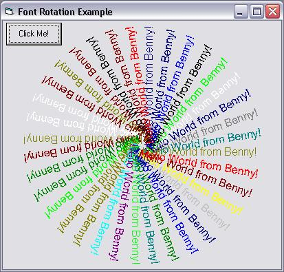



## Font Rotation Example

### Description

Font Rotate: This code provides a user method to draw text on a anything with a device Context (form, user control, printer, etc.) at any angle. This is a rework of code found on PSC by ZATRiX
 
### More Info
 
The DrawText routine takes the following:

* ByRef Canvas As Object - Device getting "drawn" on

* ByVal txt As String - text to write

* ByVal X As Single - X Coordinate

* ByVal Y As Single - Y Coordinate

* ByVal font_name As String - Font Face to use

* ByVal size As Long - Font Size

* ByVal Angle As Single - Angle of Rotation

* ByVal weight As FontWeight - How heavy a pen

* ByVal Italic As Boolean - Italic?

* ByVal Underline As Boolean - Underline ?

* ByVal Strikethrough As Boolean - Strikethrough?

Make sure that your drawing canvas has the "AutoRedraw" property set to true, otherwise your text may dissappear off the control.

             |
---                |---
**Submitted On**   |2002-04-17 12:19:26
**By**             |[Seraphire](https://github.com/Planet-Source-Code/PSCIndex/blob/master/ByAuthor/seraphire.md)
**Level**          |Advanced
**User Rating**    |4.9 (39 globes from 8 users)
**Compatibility**  |VB 5\.0, VB 6\.0
**Category**       |[Windows API Call/ Explanation](https://github.com/Planet-Source-Code/PSCIndex/blob/master/ByCategory/windows-api-call-explanation__1-39.md)
**World**          |[Visual Basic](https://github.com/Planet-Source-Code/PSCIndex/blob/master/ByWorld/visual-basic.md)
**Archive File**   |[Font\_Rotat729144172002\.zip](https://github.com/Planet-Source-Code/seraphire-font-rotation-example__1-33883/archive/master.zip)

